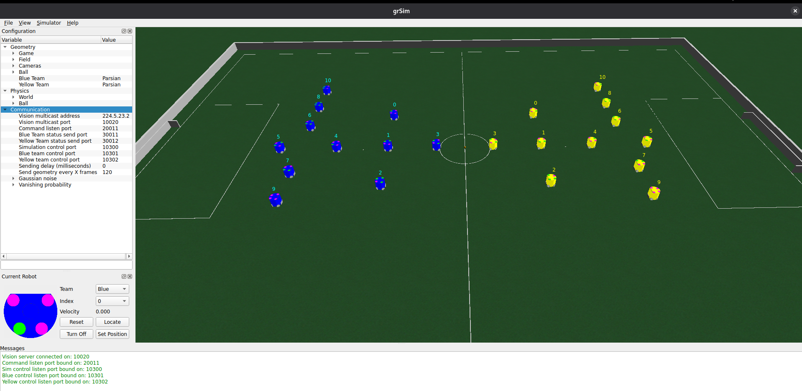

# Day 1

## 1. Install Docker

Add Docker's official GPG key:
```sh
sudo apt update
sudo apt install ca-certificates curl
sudo install -m 0755 -d /etc/apt/keyrings
sudo curl -fsSL https://download.docker.com/linux/debian/gpg -o /etc/apt/keyrings/docker.asc
sudo chmod a+r /etc/apt/keyrings/docker.asc
```

Add the repository to Apt sources:
```sh
sudo tee /etc/apt/sources.list.d/docker.sources <<EOF
Types: deb
URIs: https://download.docker.com/linux/debian
Suites: $(. /etc/os-release && echo "$VERSION_CODENAME")
Components: stable
Signed-By: /etc/apt/keyrings/docker.asc
EOF

sudo apt update
```

Install Docker packages:
```sh
sudo apt install docker-ce docker-ce-cli containerd.io docker-buildx-plugin docker-compose-plugin
```

Add yourself to the Docker group to run Docker commands without `sudo`:
```sh
sudo groupadd docker
sudo usermod -aG docker \$USER
newgrp docker
```

*Note: You should reboot your computer after doing this to ensure group changes are fully applied.*

## 2. Allow Docker to Access the X Server

To allow GUI applications (like grSim) to run from the Docker container, allow Docker to access the X server:
```sh
xhost +local:docker
```

To make it permanent, add it to the end of your `~/.bashrc`:
```sh
echo "xhost +local:docker > /dev/null" >> ~/.bashrc
source ~/.bashrc
```

## 3. Build the Image

Build the container image with the simulator (grSim), Python code, C++ embedded tools, and Rust documentation tools. This might take a few minutes as it builds the environment from scratch, layer by layer (defined in the `Dockerfile`). Subsequent builds will be much faster.

## 4. Run the Environment

The command to start the container is:
```sh
docker compose run --rm --name my_ssl dev
```

Check if the installation was correct by running the test script:
```sh
chmod +x test_env.sh
./test_env.sh
```

## 5. Local Documentation

To generate and serve the local documentation alongside your code, run:
```sh
mdbook serve ./docs
```

Then, open your browser and navigate to `http://localhost:3000` to view the documentation.

## 6. Launching grSim

To run the simulator and other tools, open two terminals and attach them to the running container:
```sh
docker exec -it my_ssl /bin/bash
```

Then, inside the container, open grSim:
```sh
grSim
```

You should see this screen:


Bravo! The setup is done. We will soon start creating our own strategy! You can now go to the [day 2](./day2.md)!
