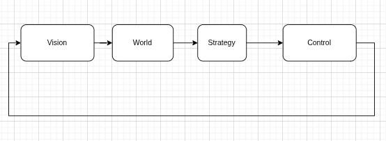

## Theoretical

### Section Summary
---
- [Theoretical](#theoretical)
  - [Section Summary](#section-summary)
  - [Understanding the project](#understanding-the-project)
  - [Pipeline](#pipeline)
      - [Vision (The Eyes):](#vision-the-eyes)
      - [World (The Mental Map):](#world-the-mental-map)
    - [Coach vs play vs skills](#coach-vs-play-vs-skills)

---

But first, let's understand how the current project works in theory.

### Understanding the project
It is recommended that as you read this tutorial, you explore the different files of the project yourself. You can see that the repository is divided into the following folders:

```text
        ├── crates
        ├── target
        └── docs
                └── src
```

- 'Crates' is the folder that contains the control code for each of the libraries used to control our robots.
- 'target' is the build folder. It is generated when you use the command:

```bash
cargo --build
```
- 'docs' is this folder, more specifically 'docs/src', where the documentation is written in .md files. For example, this tutorial you are reading is in:

```bash
/new_archi_ssl/docs/src/onboarding/onboarding.md
```
---

### Pipeline



Imagine your robot is a real soccer player. For it to work, its "brain" (the code) needs to process information in a logical order, like an assembly line.

Here is a summary of this pipeline in simple terms, following the order of the crates:

The Pipeline: From Eye to Kick
In the file crates/app/src/main.rs, the fn main() works as the "Heart" that sets the pace of the game. It runs these functions in an infinite loop:

Rust
fn main() {
    loop {
        let raw_data = vision::get_data();    // I see
        let map = world::update(raw_data);    // I understand where I am
        let decisions = strategy::plan(map);  // I decide what to do
        control::execute(decisions);          // I move!
    }
}

And these are the current crates:

```text
    ├── crates
    │   ├── app
    │   ├── control
    │   ├── shared_types
    │   ├── simu
    │   ├── strategy
    │   ├── vision
    │   └── world
```

##### Vision (The Eyes):
The robot receives images from the cameras on the ceiling of the field. The vision crate processes this information, coming from a computer program, and generates the positions of the ball and players.

Summary:
```text
+------------------------+          +-------------+        +---------------------+
|  Camera/ready software |  ---->   |   Vision    | ---->  |   Raw positions    |
+------------------------+          +-------------+        +---------------------+
```

##### World (The Mental Map):
<!-- The world crate takes this noisy data and generates a struct that contains our filtered view of our "ground truth." It creates the "map" of what is happening now.

##### Strategy (The Coach):
This is where the intelligence decides what to do. "Is the ball close? Yes. Then, Robot 1, go to it and kick." It sets the objective.

##### Control (The Muscles):
The coach decided to kick, but the robot needs to know how to turn the wheels to get there. The control calculates the exact force for each motor so the robot moves smoothly.

##### Support Pieces
###### Simu (The Videogame):

It is a simulator. Instead of turning on a real metal robot, you run the code here to test if it won't do something silly on the virtual field.

###### Shared_Types (The Dictionary):
 This is where the definitions that everyone uses are. For vision and strategy to speak the same language (e.g., what is a "Point" or a "Robot"), they consult this crate.

###### App (The Conductor):
 It is the one that starts everything and ensures that the information goes from vision to the motors in the correct order.

Summary of the Flow in main.rs:

Does this analogy of "Eyes -> Map -> Coach -> Muscles" make sense? If you want, I can detail what happens inside one of these specific crates! -->

---

#### Coach vs play vs skills
